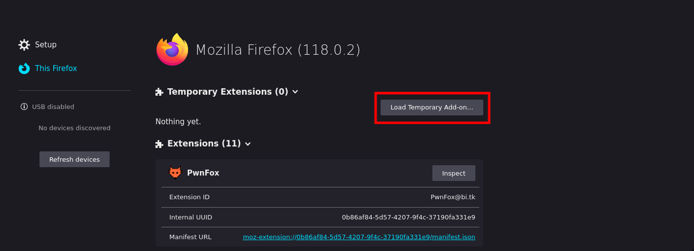
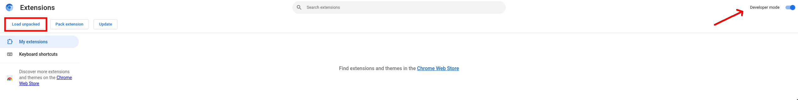
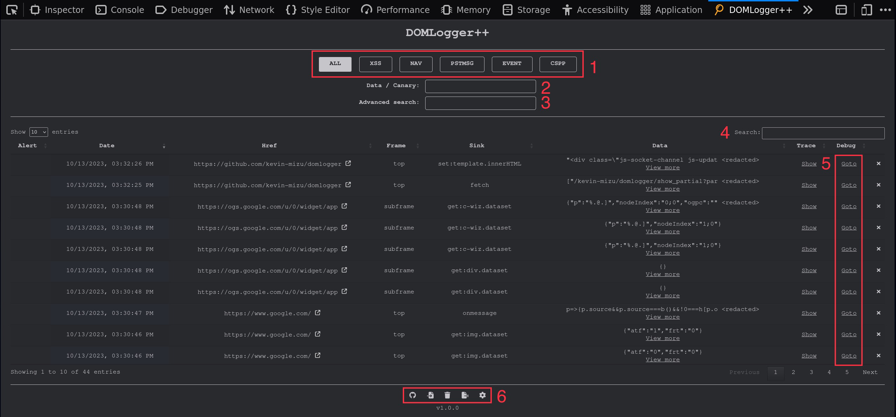
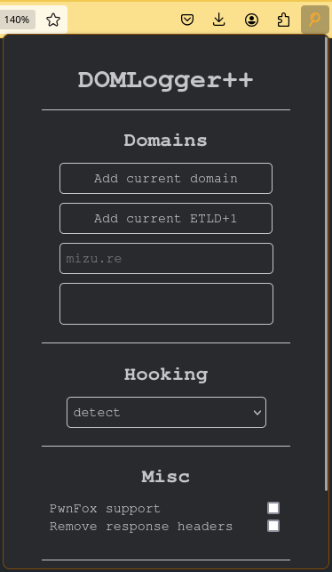

<p align="center">
    <br>
    A browser extension that allows you to monitor, intercept, and debug JavaScript sinks based on customizable configurations.
    <br>
    
    <a href="https://twitter.com/intent/follow?screen_name=kevin_mizu" title="Follow"></a>
    <br>
</p>

## 📦 Installation

**From extension stores**:

- Firefox: https://addons.mozilla.org/en-US/firefox/addon/domloggerpp
- Chromium: https://chrome.google.com/webstore/detail/domlogger%2B%2B/lkpfjhmpbmpflldmdpdoabimdbaclolp
- Safari: Not yet available.

**Manual installation**:

Download the latest release: https://github.com/kevin-mizu/domloggerpp/releases/

- Firefox: Go to `about:debugging#/runtime/this-firefox` and click on `Load Temporary Add-on`.

<p align="center">
    
</p>

- Chromium: Go to `chrome://extensions/`, enable `Developer mode` and click on `Load unpacked`.

<p align="center">
    
</p>

*if you want to build the extension by yourself, check the [app](./app/) folder.*

<br>

## 🌟 Features

- [x] Regex-based domain management.
- [x] Flexible hooking configuration (`class`, `function`, `attribute`, `event`).
- [x] Regex-based hooks arguments filtering (`match`, `!match`).
- [x] Dynamic sinks arguments update (`hookFunction`).
- [x] Customizable notifications system (`alert`, `notification`).
- [x] On-demand debugging breakpoints.
- [x] Integrated Devtools log panel.
- [x] Remote logging via webhooks.
- [x] Extensive theme customization.

<br>

## 📝 Usage example

https://github.com/kevin-mizu/domloggerpp/assets/48991194/d6ac9f90-0f44-4cd2-a5e6-890cd44b0aeb

<br>

## 🛠️ Devtools



1. `Custom filter buttons`: Dynamically generated from your custom settings, these buttons facilitate log filtering.
2. `Data/Canary search bar`: Easily filter and highlight logs using specific criteria related to a sink's args data.
3. `Advanced column search`: Tailor your search to specific column criteria, like `sink=innerHTML;frame=top`, for more refined results.
4. `Global search bar`: This default datatable feature enables searching across all columns.
5. `Debug button`: Navigate directly to the page triggering the sink, with an automatic breakpoint for debugging.
6. `Log data management buttons`:
   - Import JSON log data.
   - Clear existing log data.
   - Export log data in JSON format.

<br>

## 💬 Popup

<p align="center">
    
</p>

- `Domains`: Define allowed domains using regex to specify from which sites you'd like to receive logs.
- `Hooking`: Choose the hooking configuration to apply on the selected website.

<br>

## ⚙️ Settings

https://github.com/kevin-mizu/domloggerpp/assets/48991194/0827eef3-6c16-42fc-b84d-d8ea16def6bf

- `Settings`: Manage your hooking configurations - create, edit, modify, and remove as per your needs.
- `Domains`: Easily manage allowed domains, similar to the functionality in the popup menu.
- `Webhook`: Specify a remote host that will receive logs based on your configuration settings.
- `Devtools`: If you're using a backend server and prefer not to display information in your devtool panel, this section lets you disable that feature.
- `Customize`: Personalize the application's theme to align with your preferences.

<br>

## 🔗 Hooking configuration

### Global JSON structure

```json
{
    "hooks": {
        "category": {
            "type_1": [ "sink_1", "sink_2" ],
            "type_2": [ "sink_1", "sink_2" ]
        }
    },

    "config": {
        "*": {},
        "sink_1": {
            "match": [ "regex_1", "regex_2" ],
            "!match": [ "regex_1", "regex_2" ],
            "hookFunction": "return args",
            "alert": {
                "match": [ "regex_1", "regex_2" ],
                "!match": [ "regex_1", "regex_2" ],
                "notification": true
            }
        }
    }
}
```

*None of the specified keys in the configuration are mandatory; they can be manage to fit specific needs or omitted as desired.*

### Hooks

- `category`: Acts as a filter in the devtools panel, helping you organize and identify the sinks.
- `type_X`: Specifies the type of sink you're targeting. The possible types are:
    + class
    + attribute
    + function
    + event
    + custom
- `sink_X`: This denotes the name of the sink that needs to be hooked, the notation varies based on type:
    + `class` & `function`: Use the target name directly, such as `URLSearchParams`.
    + `event`: Only use the event name. For instance, for the onmessage event, simply use `message`.
    + `attribute`: Prefix with `set:` or/and `get:` as appropriate. An example would be `set:Element.prototype.innerHTML`.
    + `custom`: Format it as `type:sink_X`. For example, `attribute:set:jQuery.prototype.add`.

### Config

- `sink`: Refers to the target sink to be configured. It's essential for this to be present in the hooks section.
- `match`: An array of regular expressions. The parameters of the sink must respect to these patterns.
- `!match`: An array of regular expressions that the parameters of the sink should not match.
- `hookFunction`: This function takes the sink's arguments and allows you to modify them before the original function is invoked. For example, using `return [args[0] + '*2']` on `eval('2')` will result in `4`.
- `alert`: Triggers an alert badge on the extension icon based on specific conditions.
    + `match` & `!match`: Additional regular expressions that the sink parameters must respect to or avoid, respectively, in order to trigger the alert.
    + `notification`: If set to `true`, a notification popup will appear when all conditions are satisfied.

*For more detailed examples and insights, please refer to the [examples](./examples/) folder.*

<br>

## 🖥️ Backend

Not yet developed.

<br>

## 🗺️ Road map

- Set up an integrated backend server.
- Improve the scaling of the devtools panel.
- Find a way to log Content Security Policy (CSP) errors.
- Find a way to hook the document.location property.
- Simplify headless browser compatibility.
- Fix a DOS with Reflect.apply, crypto, this.nodeName.toLowerCase... hooking.
- Find a way to hook events like document.body.onclick.

<br>

## 🤝 Contributors

[Me](https://twitter.com/kevin_mizu), you?

*Special thanks to [@BitK\_](https://twitter.com/BitK_) for the well-structured code in [Pwnfox](https://github.com/yeswehack/PwnFox), it helped me a lot to understand browsers extensions ❤️*
